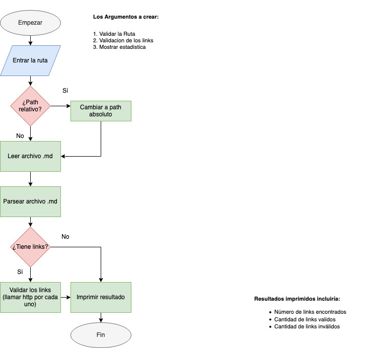

# Markdown Links

## Índice

* [1. Que es Markdown Links](#1-que-es-markdown-links)
* [2. Plan de Trabajo](#2-plan-de-trabajo)
* [3. Contenido de Modulo](#3-contenido-de-modulo)
* [4. Instrucciones de instalación/uso](#4-instrucciones-de-instalacion/uso)
* [5. Documentación del API](#5-documentacion-del-api)
* [6. Ejemplos](#6-ejemplos)

***

## 1. Que es Markdown Links

Markdown Links va a ser una libreria que sirve para extraer los links de los archivos Markdown, y que hace la validación del estado de los enlaces encontrados lo cual permite conocer si un enlace existe o si esta roto asi como conocer la mensaje de error.

### Diagrama de flujo con el algoritmo que sigue la librería.



## 2. Plan de trabajo

### Milestones:

1. Crear diagrama de flujo del algoritmo (Milestone #1):
* [x] dibujar el borrador de flujo (sketch) (issue #1.1),
* [x] pasar al draw.io para agregar al readme issue #1.2),
* [x] agregar al readme issue #1.3),
* [ ] revisar al fin y editar, si necessario issue #1.4).

2. Crear/revisar sistema/structura de archivos (fs, path)(Milestone #2):  
  
  * [x] revisar la estructura actual que ya existe despues de clonear proyecto (issue #2.1),
  * [x] decidir por la estructura adelante (issue #2.2).
  * [x] crear archivo.js para cada bloque de funciones (Ruta, Links, Estadistica) (issue #2.3),
  * [ ] revisar al fin y editar, si necessario (issue #2.4).

3. Crear las principales bloques de funciones de módulo (Milestone #3):

3.1. Ruta
* [x] buscar la ruta y cambiar a absoluta (issue #3.1.1),

3.2. Links
* [x] leer archivo de lenguage markdown (issue #3.2.1),
* [x] buscar los links (issue #3.2.2),
* [ ] validar los links llamando http por cada links (issue #3.2.3).

3.3. Estadistica
* [ ] contar cantidad de los links (issue #3.3.1),
* [ ] contar cuanto son buenos y cuanto malos (issue #3.3.2),
* [ ] imprimir los links y resultado (issue #3.3.3).

3. Install modulo via npm install
* [ ] issue#1: ......
* [ ]  issue#2: ......

4. Testear modulo
* [ ]   issue#1: .....
* [ ]  issue#2: .....


### 3. Contenido de Modulo

Modulo:
* `index.js`: contiene el modulo 
* `path.js` bloque de funciones para calcular path, validar si es absoluto o relativo,
* `links.js` bloque de funciones para buscar los links y validar llamando http,
* `statistics.js` bloque de funciones para contar los links (los validos y no validos), y mostrar estadistica.


Además:
* `README.md` descripción del módulo, instrucciones de instalación/uso, documentación del API y ejemplos. 
* `package.json` con nombre, versión, descripción, autores, licencia,   dependencias, scripts (pretest, test, ...)
* `.editorconfig` con configuración para editores de texto. 
* `.eslintrc` con configuración para linter. 
* `.gitignore` para ignorar `node_modules` u otras carpetas que no deban incluirse en control de versiones (`git`).
* `test/md-links.spec.js` contiene los tests unitarios para la función
  `mdLinks()`

## 4. Instrucciones de instalación/uso

>npm install -g ....

### ¿Como utilizar la librería? - CLI


## 5. Documentación del API 

```
npm install .....
npm start ...
```

## 6. Ejemplos


  ### ¿Como se veran tus resultados en consola?


