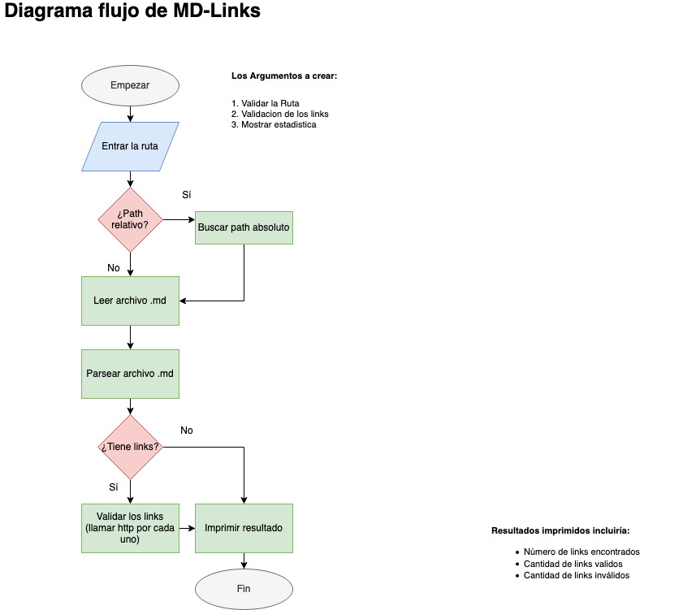

# Markdown Links

## Índice

* [1. Que es Markdown Links](#1-que-es-markdown-links)
* [2. Plan de Trabajo](#2-plan-de-trabajo)
* [3. Contenido de Modulo](#3-contenido-de-modulo)
* [4. Instrucciones de instalación/uso](#4-instrucciones-de-instalacion/uso)
* [5. Documentación del API](#5-documentacion-del-api)
* [6. Ejemplos](#6-ejemplos)

***

## 1. Que es Markdown Links

Markdown Links va a ser una libreria que sirve para extraer los links de los archivos Markdown, y que hace la validación del estado de los enlaces encontrados lo cual permite conocer si un enlace existe o si esta roto asi como conocer la mensaje de error.

### Diagrama de flujo con el algoritmo que sigue la librería.



## 2. Plan de trabajo

### Milestones:

1. Crear diagrama de flujo del algoritmo

2. Crear/revisar sistema/structura de archivos (fs, path):  
  
  - revisar la estructura actual que ya existe despues de clonear proyecto (issue #1),
  - decidir por la estructura adelante (issue #2).

3. Crear módulos para:
- leer archivo de lenguage markdown (issue #1), 
- contar cantidad de los links ((issue #2),
- validar los links llamando http por cada links (issue #3),
- imprimir los links y resultado (issue #4).

3. Install modulo via npm install
  issue#1: ......
  issue#2: ......

4. Testear modulo
  issue#1: .....
  issue#2: .....


### 3. Contenido de Modulo

* `README.md` descripción del módulo, instrucciones de instalación/uso, documentación del API y ejemplos. 
* `index.js`: Desde este archivo se exporta la función (`mdLinks`).
* `package.json` con nombre, versión, descripción, autores, licencia,   dependencias, scripts (pretest, test, ...)
* `.editorconfig` con configuración para editores de texto. 
* `.eslintrc` con configuración para linter. 
* `.gitignore` para ignorar `node_modules` u otras carpetas que no deban incluirse en control de versiones (`git`).
* `test/md-links.spec.js` contiene los tests unitarios para la función
  `mdLinks()`

## 4. Instrucciones de instalación/uso

>npm install -g ....

### ¿Como utilizar la librería? - CLI


## 5. Documentación del API 

```
npm install .....
npm start ...
```

## 6. Ejemplos


  ### ¿Como se veran tus resultados en consola?


